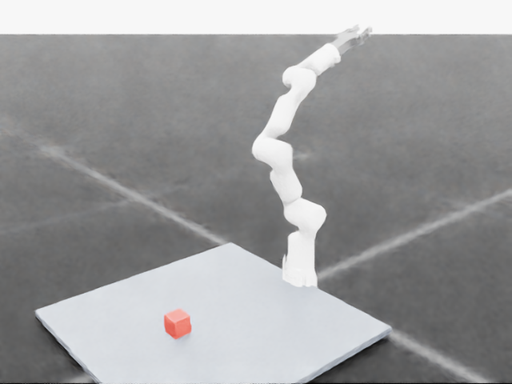
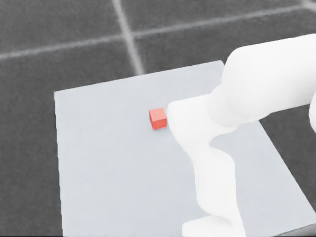
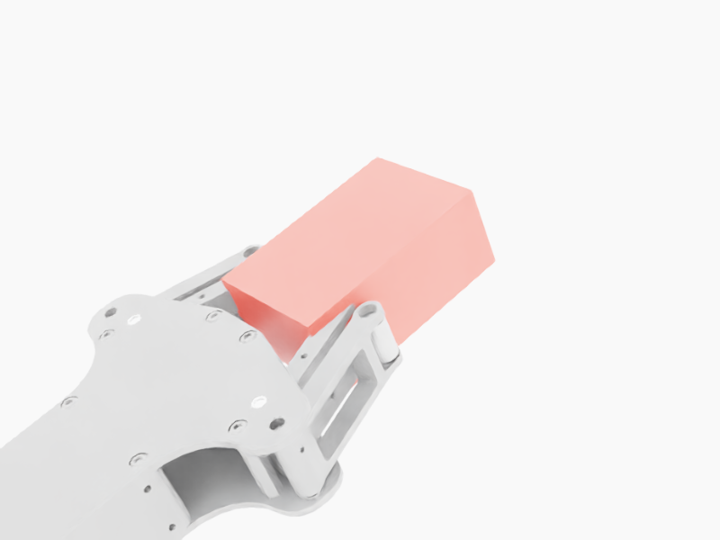

# 004 - RM65 + 4C2 夹爪迁移到 Isaac Lab

这个项目把实验室的 RM65-B 机械臂和 4C2 两指夹爪整理成一个可复现的 Isaac Lab 仿真资产，并建立后续接入 π0.5 所需的状态与动作接口。

## 本阶段为什么不能直接接 π0.5

已经验证的 π0.5 checkpoint 针对 DROID 风格的 Franka：输入包含 7 个 Franka 关节角，输出是 7 个 Franka 绝对目标关节角和 1 个夹爪命令。RM65 只有 6 个关节，关节零位、运动学和夹爪定义也不同。因此不能把前 6 个输出直接发送给 RM65。

本项目先完成三个安全前置条件：

1. 组合 RM65 与真实 4C2 模型；
2. 在 Isaac Lab 中验证全部关节可读取、可复位、可受限控制；
3. 明确 π0.5 与 RM65 之间哪些字段兼容、哪些字段必须通过自有数据微调。

## 当前结果

已完成并验证：

- 使用用户提供的 `D:\\d\\4C2` 作为夹爪模型来源；
- 生成 RM65-B + 4C2 组合 URDF：16 个 link、15 个 joint；
- 导入 USD，articulation root 为 `/rm65_4c2/root_joint`；
- 识别 6 个 RM65 关节和 6 个 4C2 物理自由度，并把单一夹爪命令软件耦合到所有指节；
- 有界运动与回零测试通过，所有状态均为有限数值；
- Lula 全位姿 IK 在组合 USD 上通过，正确映射六轴并跳过夹爪自由度；
- 传统 IK 专家控制器完成红方块上方 10 cm 的平滑预抓取到位；
- 12 个随机可达目标的到位鲁棒性评测全部通过；
- 验证 4C2 的正方向为闭合：两组指尖代理距离均单调减小；
- 60×40×25 mm 悬浮测试块按夹爪局部坐标对齐后，静态闭合保持有限数值；安全外移 10 mm 时无接触，零偏移时只与 `tool_base_link` 接触并被推出 `0.04797 m`，左右指尖均未确认接触；
- 根据闭合姿态反算左右指面局部坐标，加入两个薄盒碰撞垫；5 个中心附近位置全部形成双侧静态接触，最大物体位移 `1.370 mm`，且 12 目标到位回归仍为 12/12；
- 修复夹持后运输命令的 `float64`/`float32` 类型错误，给接触设置明确的高摩擦材料，并在夹紧后恢复测试块重力；中心及横向 ±2 mm 的 3 次抬升运输全部通过；
- 建立“初始化在抓取位 → 闭合 → 抬升 → 转运 → 辅助释放到平台 → 撤离”的开发状态机；关节 1 转动 0.6、0.8、1.0 rad 三次均通过。该基线使用初始化抓取位、延迟启用平台碰撞和 50 mm 释放分离辅助，不能算无辅助完整任务，也没有使用 π0.5；
- 去掉“初始化在抓取位”，从方块外侧 2、4、6、10 cm 依次执行笛卡尔接近；4/4 次都完成闭合、抬升、转移和辅助放置，最小抬升 `0.03730 m`，最大落点误差 `0.00863 m`。闭合前方块仍暂时关闭重力，因此这是动态接近基线，不是自然桌面抓取；
- 区分接触力峰值、当前值和最近窗口均值后，确认原来的 `25×10×20 mm` 经验碰撞垫只产生瞬时接触；单独生成 `40×14×18 mm` 宽垫候选资产，在自然重力下获得持续双侧接触；
- 修正抬升轨迹，使末端沿世界 z 方向上升 40 mm。0.8 rad 转运角的单次自然重力实验完成抓取、抬升 39.07 mm、转运约 17 cm 和辅助放置，最终误差 `2.918 mm`；三种转运角复测仅通过 1/3，说明抓取和运输已跑通，释放与落台仍不鲁棒；
- USD 物理清单确认 16 个刚体、16 个启用的碰撞体，4C2 的 9 个 link 均保留碰撞；
- 定义外部/腕部 RGB、六轴关节和夹爪状态的 π0.5 观测接口；
- 实现 RM65 专用 OpenPI 输入/输出 transform，并在 OpenPI 容器内通过单元测试；
- 实现关节限位、最大单步变化和非有限数值拒绝的动作安全层；
- DROID checkpoint 的输出只做接口 dry-run，不发送给仿真或真机。

最终验证数据：

| 检查 | 结果 |
|---|---:|
| 无重力结构测试 | PASS |
| RM65 与 4C2 固定部分开启重力、六个活动指节隔离重力 | PASS |
| 组合 USD 的 Lula IK 位置误差 | `0.00000103 m` |
| 组合 USD 的 Lula IK 旋转误差 | `0.000918 rad` |
| 单次预抓取最终位置误差 | `0.00000097 m` |
| 多目标预抓取评测 | `12/12`，100% |
| 多目标最差位置误差 | `0.00002091 m` |
| 多目标最大命令步长 | `0.03909 rad` |
| 4C2 指尖距离趋势 | 正方向单调闭合，PASS |
| 4C2 静态闭合稳定性 | PASS，接触未确认 |
| 悬浮测试块闭合期间位移 / 接触力 | `0 m / 0 N` |
| 零偏移对照 | 基座接触 `0.136 N`，指尖双侧接触否 |
| 碰撞垫静态夹持扰动测试 | `5/5`，双侧接触 |
| 碰撞垫最小左 / 右接触力 | `0.07786 / 0.06647 N` |
| 碰撞垫最大物体位移 / 基座力 | `0.001370 m / 0 N` |
| 碰撞垫重力运输扰动测试 | `3/3`，100% |
| 运输最小物体抬升 | `0.03760 m` |
| 运输最大物体相对夹爪位移 | `0.02983 m` |
| 辅助抓取搬运状态机 | `3/3`，仅仿真开发基线 |
| 辅助状态机最小抬升 / 搬运距离 | `0.03783 / 0.15928 m` |
| 辅助状态机最大落点误差 / 落台漂移 | `0.00520 m / 3.73×10⁻⁹ m` |
| 动态接近距离评测 | `4/4`（2、4、6、10 cm），仍含闭合前方块重力辅助 |
| 动态接近最小抬升 / 最大落点误差 | `0.03730 / 0.00863 m` |
| 宽碰撞垫自然重力最近窗口双侧接触力 | 至少 `0.5686 / 0.5041 N`（三次完整实验） |
| 自然重力持续承重抬升 | 3/3，最小抬升 `0.03907 m` |
| 自然重力完整辅助状态机 | 1/3；0.8 rad 最终误差 `0.00257 m` |
| 无辅助自然释放 | FAIL，方块仍被夹爪夹持或带走 |
| USD 刚体 / 启用碰撞体 | `16 / 16` |
| 外部图红色目标像素 | 966 |
| 腕部图红色目标像素 | 1256 |
| 腕部相机随末端移动 | `0.01818 m`，PASS |
| 相机到末端距离变化 | `5.96×10⁻⁸ m` |
| π0.5 输出 | `15×8`，全部有限 |
| π0.5 首次推理 | `152.10 s` |
| π0.5 稳态推理 | `0.316 s` |
| RM65 transform 单元测试 | PASS |
| 动作安全层单元测试 | PASS |
| 策略动作被执行 | 否 |







完整过程、概念解释和实测数据见 [阶段报告与复现手册](docs/RM65_4C2_STAGE_REPORT_ZH.md)。

机器可读证据在 `results/`：组合/导入报告、无重力与重力隔离测试、已知重力失败、观测报告以及 π0.5 首次/稳态 dry-run。

腕部相机采用显式工具坐标变换：保存相机相对 `tool_base_link` 的局部位姿，每个仿真步根据末端姿态更新相机。两组机械臂姿态验证了相机移动 `0.01818 m`，相机到末端距离仅变化 `5.96×10⁻⁸ m`，两次位姿命令误差均为 0。当前双相机仍分别在两个 Isaac Sim 进程中采集，闭环任务环境还要把同一更新函数放入每个控制周期，并根据实物安装尺寸校准外参。

## 实验室资产

默认使用以下文件；可以通过命令行参数替换：

```text
RM65 URDF:
~/robot-learning/rm-ik-rl/assets/RM65-B/urdf/RM65-B.urdf

RM65 meshes:
~/robot-learning/rm-ik-rl/assets/RM65-B/meshes

4C2 URDF:
external/4C2/urdf/4C2.urdf

4C2 meshes:
external/4C2/meshes
```

模型文件较大，不上传 GitHub。本项目上传生成脚本、接口说明和小型验证结果。

## 运行顺序

在本项目目录执行：

```bash
python3 scripts/build_combined_urdf.py \
  --rm65-urdf ~/robot-learning/rm-ik-rl/assets/RM65-B/urdf/RM65-B.urdf \
  --rm65-mesh-dir ~/robot-learning/rm-ik-rl/assets/RM65-B/meshes \
  --gripper-urdf external/4C2/urdf/4C2.urdf \
  --gripper-mesh-dir external/4C2/meshes \
  --gripper-root-link base_link \
  --gripper-name-prefix tool_ \
  --output generated/rm65_4c2_software.urdf \
  --report outputs/combined_urdf_report.json
```

需要验证静态夹持时，在相同命令中加入 `--add-4c2-contact-pads`，并把输出改为独立文件，避免覆盖原始资产：

```bash
python3 scripts/build_combined_urdf.py \
  --rm65-urdf ~/robot-learning/rm-ik-rl/assets/RM65-B/urdf/RM65-B.urdf \
  --rm65-mesh-dir ~/robot-learning/rm-ik-rl/assets/RM65-B/meshes \
  --gripper-urdf external/4C2/urdf/4C2.urdf \
  --gripper-mesh-dir external/4C2/meshes \
  --gripper-root-link base_link \
  --gripper-name-prefix tool_ \
  --add-4c2-contact-pads \
  --output generated/rm65_4c2_contact_pads.urdf \
  --report outputs/contact_pads_urdf_report.json
```

导入为 USD：

```bash
~/robot-learning/IsaacLab/isaaclab.sh -p scripts/import_combined_urdf.py \
  --urdf generated/rm65_4c2_software.urdf \
  --usd generated/rm65_4c2_software.usd \
  --report outputs/import_report.json \
  --headless
```

运行受限关节控制测试：

```bash
~/robot-learning/IsaacLab/isaaclab.sh -p scripts/smoke_test_articulation.py \
  --usd generated/rm65_4c2_software.usd \
  --output outputs/articulation_smoke.json \
  --gripper-control-mode software-coupled \
  --enable-gravity \
  --disable-moving-gripper-gravity \
  --headless
```

确认组合 USD 的前六轴顺序和 Lula 全位姿 IK 映射：

```bash
~/robot-learning/IsaacLab/isaaclab.sh -p scripts/test_combined_ik.py \
  --usd generated/rm65_4c2_software.usd \
  --urdf ~/robot-learning/rm-ik-rl/assets/RM65-B/urdf/RM65-B.urdf \
  --description ~/robot-learning/rm-ik-rl/rm65_robot_description.yaml \
  --output outputs/combined_ik_test.json
```

先用传统 IK 专家控制器验证预抓取到位，再测试多个可达目标：

```bash
~/robot-learning/IsaacLab/isaaclab.sh -p scripts/run_reach_baseline.py \
  --usd generated/rm65_4c2_software.usd \
  --urdf ~/robot-learning/rm-ik-rl/assets/RM65-B/urdf/RM65-B.urdf \
  --description ~/robot-learning/rm-ik-rl/rm65_robot_description.yaml \
  --output outputs/reach_baseline.json

~/robot-learning/IsaacLab/isaaclab.sh -p scripts/run_reach_robustness_suite.py \
  --usd generated/rm65_4c2_software.usd \
  --urdf ~/robot-learning/rm-ik-rl/assets/RM65-B/urdf/RM65-B.urdf \
  --description ~/robot-learning/rm-ik-rl/rm65_robot_description.yaml \
  --output outputs/reach_robustness.json \
  --trials 12 --seed 7
```

这两项只完成“移动到预抓取位姿”，没有闭合夹爪、接触方块或搬运方块，因此不能称为抓取成功。

验证夹爪开合方向与默认安全的静态闭合：

```bash
~/robot-learning/IsaacLab/isaaclab.sh -p scripts/test_gripper_aperture.py \
  --usd generated/rm65_4c2_software.usd \
  --output outputs/gripper_aperture_test.json \
  --headless

~/robot-learning/IsaacLab/isaaclab.sh -p scripts/test_gripper_close_stability.py \
  --usd generated/rm65_4c2_contact_pads.usd \
  --output outputs/gripper_contact_pads_center.json \
  --headless

python3 scripts/summarize_gripper_contact_pads.py

~/robot-learning/IsaacLab/isaaclab.sh -p scripts/test_gripper_close_stability.py \
  --usd generated/rm65_4c2_contact_pads.usd \
  --output outputs/gripper_contact_transport.json \
  --attempt-lift \
  --headless
```

静态阶段使用关闭重力的悬浮测试块且不放置桌面，以免把桌面接触力误判为夹爪接触；`--attempt-lift` 在确认双侧接触后恢复物体重力，再执行 1 秒平滑运输。测试块根据二级指尖位置自动对齐夹爪局部坐标；长度、宽度、高度、质量、内移量、横向偏移、闭合角、闭合步数和运输步数都可通过参数修改。接触处理已开启，4C2 全部 9 个 link 与测试块自身都有独立传感器。原始凸包的零偏移接触来自夹爪基座；反算得到的两个碰撞垫在五个静态扰动位置形成双侧接触，并在中心及横向 ±2 mm 的三个位置完成重力运输。先前的“PhysX 原生退出”实际是 NumPy `float64` 命令写入 PyTorch `float32` 张量导致的异常，现已修复并保留显式回溯输出。碰撞垫来自仿真姿态反算，还需要用真实夹爪尺寸校准。

完整复现实验套件会依次运行 5 个静态位置、3 个运输位置和两份汇总：

```bash
bash scripts/run_gripper_contact_suite.sh
```

从已验证抓取姿态运行带开发辅助的搬运和放置状态机：

```bash
~/robot-learning/IsaacLab/isaaclab.sh -p scripts/run_pick_place_baseline.py \
  --usd generated/rm65_4c2_contact_pads.usd \
  --urdf ~/robot-learning/rm-ik-rl/assets/RM65-B/urdf/RM65-B.urdf \
  --description ~/robot-learning/rm-ik-rl/rm65_robot_description.yaml \
  --output outputs/pick_place_robust_0p8.json \
  --transfer-joint-1-rad 0.8 \
  --initialize-at-grasp \
  --headless

python3 scripts/summarize_pick_place_assisted.py
```

一键顺序运行三种转角并汇总：

```bash
bash scripts/run_pick_place_assisted_suite.sh
```

这条命令会让 30 g 方块承受重力并真实完成抬升、转运和落台，但仍包含四个明确的开发辅助：从抓取姿态初始化、闭合前暂时关闭方块重力、转运后才启用目标平台碰撞、打开夹爪后向下分离 50 mm 并给 0.10 m/s 初速度。0.6、0.8、1.0 rad 三组结果汇总为 3/3，最大落点误差 `5.20 mm`。它用于验证后半程状态机，不能用于训练，也不能写成 π0.5 或无辅助完整抓取成功。

从多个安全距离动态接近，而不是直接初始化到抓取位：

```bash
bash scripts/run_pick_place_dynamic_suite.sh
```

该套件顺序测试 2、4、6、10 cm，并用 `summarize_pick_place_dynamic.py` 汇总。四次都通过，但闭合前方块仍暂时关闭重力，放置端仍包含延迟平台碰撞和释放分离辅助。

原始 `25×10×20 mm` 经验碰撞垫的闭合角扫描可用下面的命令复现。结果是 7 个闭合角都没有持续双侧接触，说明此前只看峰值会误把瞬时碰撞当成稳定夹持：

```bash
bash scripts/run_natural_close_sweep.sh
```

宽碰撞垫必须生成到独立资产，避免覆盖原始模型：

```bash
python3 scripts/build_combined_urdf.py \
  --rm65-urdf ~/robot-learning/rm-ik-rl/assets/RM65-B/urdf/RM65-B.urdf \
  --rm65-mesh-dir ~/robot-learning/rm-ik-rl/assets/RM65-B/meshes \
  --gripper-urdf external/4C2/urdf/4C2.urdf \
  --gripper-mesh-dir external/4C2/meshes \
  --gripper-root-link base_link \
  --gripper-name-prefix tool_ \
  --add-4c2-contact-pads \
  --4c2-contact-pad-size-m 0.040 0.014 0.018 \
  --output generated/rm65_4c2_wide_pads.urdf \
  --report outputs/wide_pads_urdf_report.json

~/robot-learning/IsaacLab/isaaclab.sh -p scripts/import_combined_urdf.py \
  --urdf generated/rm65_4c2_wide_pads.urdf \
  --usd generated/rm65_4c2_wide_pads.usd \
  --report outputs/wide_pads_import_report.json \
  --headless
```

运行三种转运角的自然重力套件：

```bash
bash scripts/run_pick_place_natural_suite.sh
```

该套件让方块从一开始就承受重力，并从 10 cm 外动态接近。三次都稳定抬升 39.07 mm，但只有 0.8 rad 完成验收；0.6 rad 因落台后漂移 43.09 mm 失败，1.0 rad 的最终误差为 52.02 mm。当前仍关闭机械臂及活动指节的重力，使用未经实物标定的宽碰撞垫、延迟启用目标平台碰撞，并在释放时向下分离 80 mm、施加 0.10 m/s 初速度。去掉释放辅助后，方块会卡在指间或随夹爪离开，因此下一步是让机械臂先下降到平台附近再张开夹爪。

生成两张 `480×640` RGB 观测图和关节状态；客户端会补边缩放为模型使用的 `224×224`：

```bash
./scripts/capture_observation.sh
```

启动 π0.5、发送一次非执行式接口请求并停止服务：

```bash
./scripts/start_pi05_droid_server.sh
./scripts/run_pi05_interface_dry_run.sh --prompt "pick up the red cube"
./scripts/stop_pi05_server.sh
```

验证未来 RM65 transform 和动作安全层，并汇总全部阶段证据：

```bash
docker start libero-openpi_server-1
docker exec -e PYTHONPATH=/rm65_project libero-openpi_server-1 \
  /.venv/bin/python3 /rm65_project/scripts/test_rm65_policy_transform.py
docker stop libero-openpi_server-1

PYTHONPATH=. python3 scripts/test_action_guard.py
python3 scripts/summarize_stage_results.py
```

接口的机器可读定义在 [rm65_pi05_interface.json](config/rm65_pi05_interface.json)。

## 安全边界

这些脚本只控制 Isaac Lab 中的仿真 articulation，不包含 ROS2 真机控制接口。π0.5 原始动作只允许记录和分析；在完成 RM65 数据采集、动作定义与微调以前，不允许转成真机命令。

4C2 的六个活动指节在 PhysX 重力下会出现非物理大扭矩，因此最终 USD 移除 mimic 标签，由仿真控制层同步六个夹爪关节，并只对这六个活动指节关闭重力。RM65、夹爪基座和两个固定支座仍启用重力，夹爪碰撞与关节运动仍保留。去除地面、1 kHz 时间步、惯量正则化和只隔离四个远端指节均不能消除失败；详细证据见阶段报告和 `results/diagnostic_*.json`。
